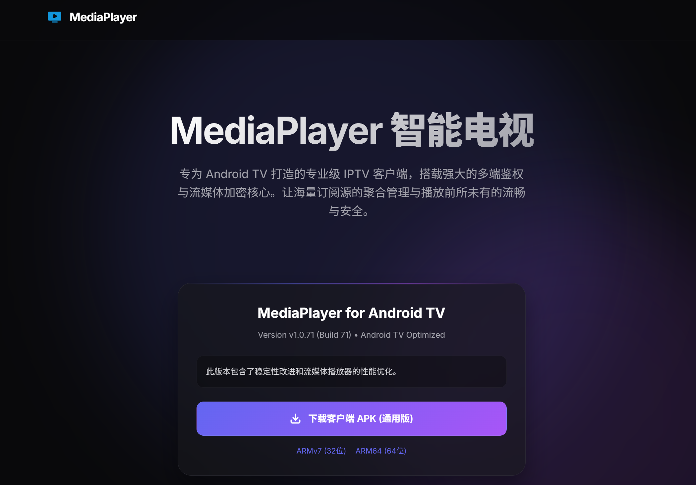
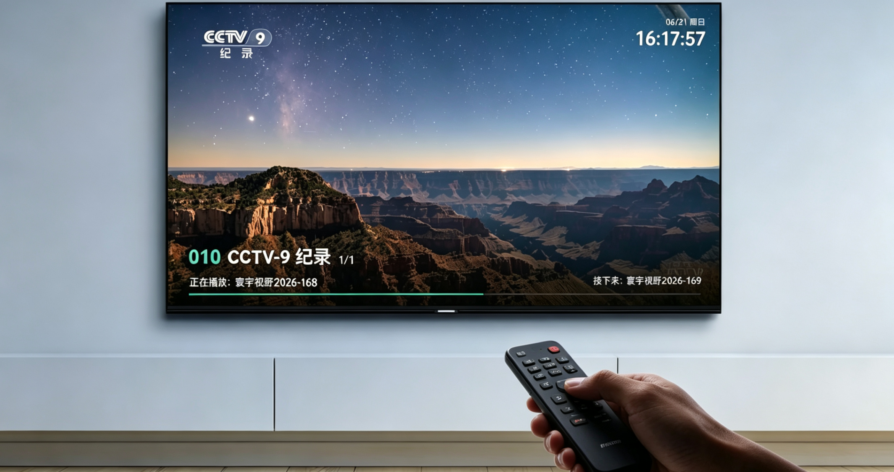
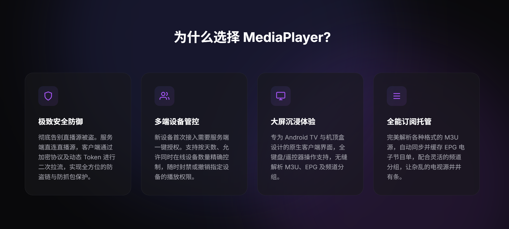

<div align="center">
  
  <h1>MediaPlayer 智能电视流媒体中心</h1>
  <p><b>专为 Android TV 与机顶盒打造的专业级私有化 IPTV 客户端</b></p>
</div>

---

## 🌟 核心理念

MediaPlayer 并不是一个普通的本地播放器，而是一套**「服务端管控 + 客户端沉浸播放」**的完整私有化流媒体解决方案。

它致力于帮助您将海量、杂乱的 M3U 直播源和 EPG 电子节目单，转化为如同“有线电视”一般顺滑、有组织的观影体验。经过数个版本的迭代与进化，MediaPlayer 现已具备强悍的流媒体代理、实时会话管控、无感健康检查及客户端 OTA 自动升级等高级企业级特性，让您的独家直播源从此告别被盗链、被抓包的风险，同时极大降低运维成本。

---

## 截图





---

## ✨ 核心产品特色

### 🛡️ 1. 极致的安全防御与流管理
- **源站隐身 (Proxy Mode)**：客户端不再直接向真实的直播源发起请求，所有的 M3U 订阅、EPG 获取和视频流拉取均由服务端代理转发，真实源地址完全隐身。
- **流媒体多路复用 (Multiplexing)**：支持代理流复用技术。当多个家庭成员或设备同时观看同一频道时，服务端只向真实源站拉取一路视频流，极大节省您的网络下行与上行带宽。
- **直连与代理随心切换**：支持频道和分组级别的“直连/代理”模式配置，兼顾播放速度与源站安全。
- **动态 Token 鉴权**：客户端通过加密协议及动态生成的 Token 进行二次拉流，实现全方位的防盗链与防抓包保护，彻底告别直播源被恶意窃取。

### 👥 2. 强大的多端设备与会话管控
- **一键准入机制**：新设备首次下载安装客户端后无法直接播放，需要服务端管理后台的“一键授权”，防止陌生设备蹭网。
- **活跃流实时监控**：在后台管理面板中，实时监控所有在线播放的客户端会话。支持查看设备的 IP、实时下载网速（KB/s）、播放的频道及历史活跃时间。
- **一键“踢下线”**：一旦发现异常占用或超时，可随时在后台一键“强制熔断”指定设备的流传输，精准切断播放。
- **全方位审计日志**：详细记录所有客户端的心跳、登录、播放动作及错误日志，随时掌控设备运行状态。

### 📺 3. 大屏沉浸式体验
- **原生 TV 界面**：专为 Android TV（智能电视、网络机顶盒）大屏设计的原生客户端界面，操作丝滑流畅，支持多格式硬件解码。
- **完全适老化操作**：深度适配电视遥控器和全键盘操作，老人小孩无需学习即可通过方向键和确认键完成频道切换、菜单呼出等操作。
- **毫秒级换台**：内置深度优化的底层播放内核（基于 ExoPlayer / VLC），在弱网环境下依然能做到秒开换台。

### 📂 4. 自动化源站运维与管理
- **无缝解析 M3U**：完美兼容各种复杂格式的 M3U/M3U8 直播源文件。
- **无感健康检查**：内置频道健康检查机制，支持在后台平滑扫描失效源，自动剔除或标注不可用频道，完全不影响正在播放的用户。
- **灵活的频道分组**：支持在服务端灵活拖拽排序、批量调整频道分类，让再杂乱无章的电视源都能变得井井有条。
- **EPG 自动同步**：自动同步并缓存 EPG（电子节目单），让观众随时知道“正在播放什么”和“接下来播放什么”。

### 🔄 5. 无忧的自动版本升级 (OTA)
- **服务端一键拉取**：管理后台深度集成了 GitHub Releases，可自动检测最新版本，并一键下载最新版 APK 到服务端。
- **客户端平滑升级**：电视端每次启动时自动与服务端校验版本。当有新版时，直接从私有服务端高速下载更新并弹出安装提示，从此告别 U盘繁琐拷贝升级。

---

## 🚀 部署与使用

> 本项目分为**服务端（Backend）**和**客户端（Android App）**两部分。服务端提供核心的流代理、设备管控与后台面板，客户端则安装在电视或机顶盒上提供播放界面。

### 1. 服务端部署
#### 方法一：Docker
通过公开提供的 Docker 镜像，只需一行命令即可在任何 Linux/NAS 环境中快速拉起服务端：
```bash
docker run -d \
  -p 9527:9527 \
  -v /path/to/your/data:/app/data \
  --name mediaplayer-server \
  ghcr.io/kuai410022283/mediaplayer:latest
```
*(部署完成后，即可通过浏览器访问 Web 管理后台，上传您的 M3U 文件并管理设备。)*

#### 方法二：[飞牛OS应用](https://github.com/Brian099/fn_fpk_packages/blob/main/README.md)
下载获取mediaplayer.fpk最新服务端，按照说明进行安装

#### 方法三：[群晖套件](https://github.com/kuai410022283/syno-mediaplayer)
下载获取mediaplayer.spk最新服务端，按照说明进行安装

#### 方法四：手动命令安装
```bash
sudo chmod 0755 mediaplayer
./mediaplayer
```

#### 📦 服务端支持架构一览

请根据您的设备架构，从 [Releases 页面](https://github.com/kuai410022283/mediaplayer/releases) 下载对应的二进制包。

**二进制包（tar.gz）**

| 架构 | 文件名 | 适用设备 | 部署方式 |
|------|--------|---------|---------|
| x86-64 | `mediaplayer-linux-amd64.tar.gz` | 软路由（N100/J4125）、NAS、VPS、PVE虚拟机 | 二进制 |
| ARM64 | `mediaplayer-linux-arm64.tar.gz` | 晶晨 S905/S922X、树莓派4+、NAS、瑞芯微 RK3588 | 二进制 |
| ARMv7l | `mediaplayer-linux-arm-armv7l.tar.gz` | 树莓派2/3、晶晨旧款 S805、老款 NAS | 二进制 |
| 龙芯 LoongArch | `mediaplayer-linux-loong64.tar.gz` | 龙芯 3A5000 / 3A6000 及以上 | 二进制 |
| RISC-V 64 | `mediaplayer-linux-riscv64.tar.gz` | VisionFive 2、Milk-V Pioneer 等新兴平台 | 二进制 |
| macOS (Intel) | `mediaplayer-darwin-amd64.tar.gz` | Intel Mac | 二进制 |
| macOS (Apple) | `mediaplayer-darwin-arm64.tar.gz` | Apple Silicon Mac（M1/M2/M3） | 二进制 |
| Windows | `mediaplayer-windows-amd64.zip` | Windows PC | 二进制 |

**Docker 多架构镜像**（同一镜像标签，按宿主机自动匹配）

| 平台 | 适用设备 |
|------|---------|
| `linux/amd64` | 软路由、NAS、VPS |
| `linux/arm64` | 晶晨 S905/S922X、树莓派4+、NAS |
| `linux/arm/v7` | 树莓派2/3、ARMv7 设备 |

> **💡 不确定自己的架构？** 在设备 SSH 终端运行 `uname -m` 查看：
> - `x86_64` → 下载 `amd64`
> - `aarch64` / `arm64` → 下载 `arm64`
> - `armv7l` → 下载 `arm-armv7l`
> - `loongarch64` → 下载 `loong64`
> - `riscv64` → 下载 `riscv64`


### 2. 客户端安装

请前往本仓库的 **[Releases 页面](https://github.com/kuai410022283/mediaplayer/releases)** 下载最新版本的 `mediaplayer-x.x.x-release.apk`。
- 将 APK 放入 U盘插入电视进行安装，或者通过当贝市场等第三方工具推送到电视端。
- 打开 App 后，系统会自动生成设备唯一识别码，将其提供给服务端管理员进行授权即可开启观影之旅。


---

## 🎮 客户端操作说明

客户端经过深度适老化与全平台兼容设计，同时支持**电视遥控器**按键操作与**手机/平板设备**的触控手势操作。

> **操作速查表**

| 功能区域 | 操作 | 📱 触控/手势 | 📺 遥控操作 |
|---------|------|-------------|-------------|
| **OSD 信息** | 显示信息栏（5 秒自动隐藏） | `单击` (Tap) | `OK 键` |
| **频道列表** | 呼出 | `右滑` (→) | `左键` (←) |
| | 关闭 | `左滑` (←) | `返回键` (BACK) |
| | 浏览频道 | — | `上/下键` |
| | 切换分组 | — | 频道列表中 `左/右键` |
| | 播放选中频道 | — | `OK 键` |
| **EPG 节目单** | 呼出 | `左滑` (←) *无面板时* | 频道列表中焦点 `右键 →` |
| | 关闭 | `右滑` (→) | `返回键` (BACK) |
| **换台** | 上一台 / 下一台 | `上滑` / `下滑` | `上/下键` *无面板时* |
| **设置栏** | 呼出 / 隐藏 | `双击` (Double Tap) | `Menu 键` |
| **线路切换** | 手动选择直播源 | `长按` (Long Press) | `长按 OK 键` |
| **亮度/音量** | 调节亮度与音量 | `屏幕左/右侧上下滑动` | 遥控器 `音量+/-` 键 |
| **音轨/字幕** | 呼出切换面板 | `单击 OSD 上的按钮` | `INFO 键` |
| **点播控制** | 暂停 / 播放 (仅点播模式) | `OSD 显示时单击屏幕` | `OSD 显示时按 OK 键` |

---

<p align="center">
  <i>—— “让海量订阅源的聚合管理与播放前所未有的流畅与安全” ——</i>
</p>

## 联系与支持

- QQ群1：292437580
- QQ群2：864744268
- Telegram：[@mediaplayer_chat](https://t.me/+3qS4i6yrHsc2MWNl)
- Email：kuai410022283@qq.com
- **捐赠**：如果觉得项目对你有用，可以捐赠任意资金，捐赠的资金会用来维护项目及开发成本。
- 

## LICENSE
请遵守 [LICENSE](LICENSE)，不得用于任何商业用途。
