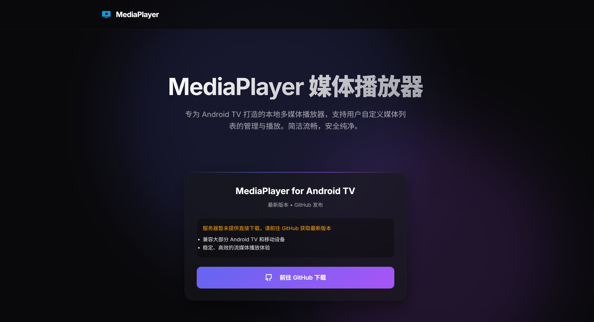
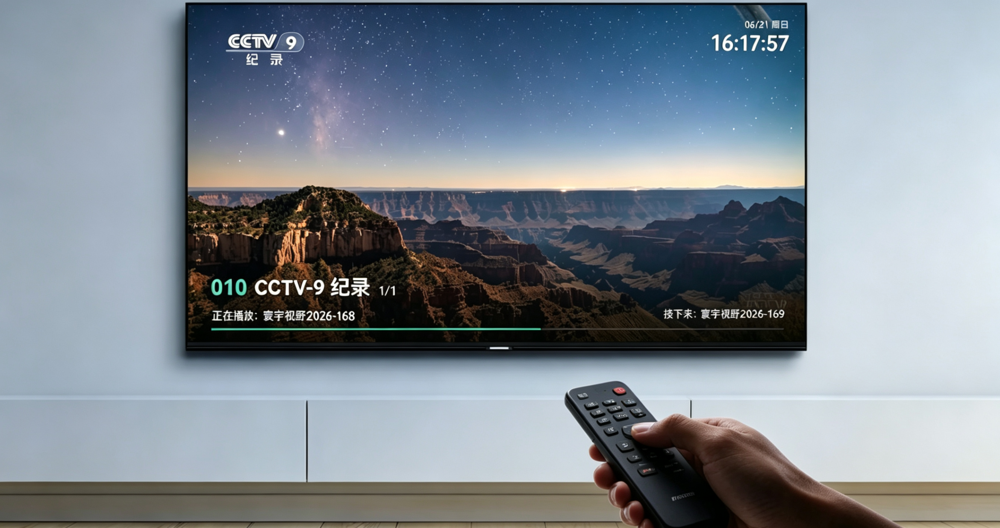
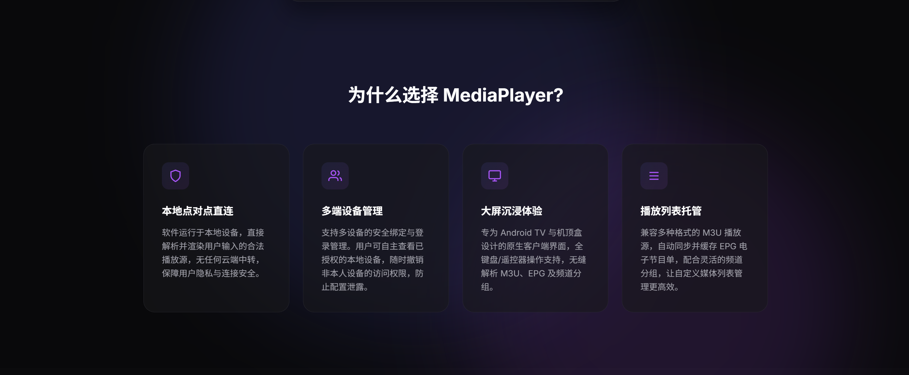
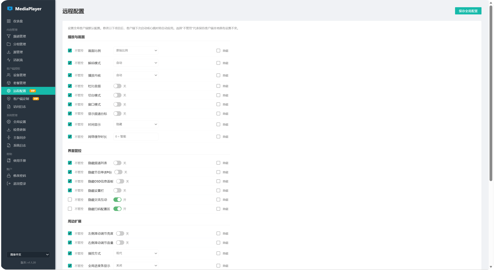
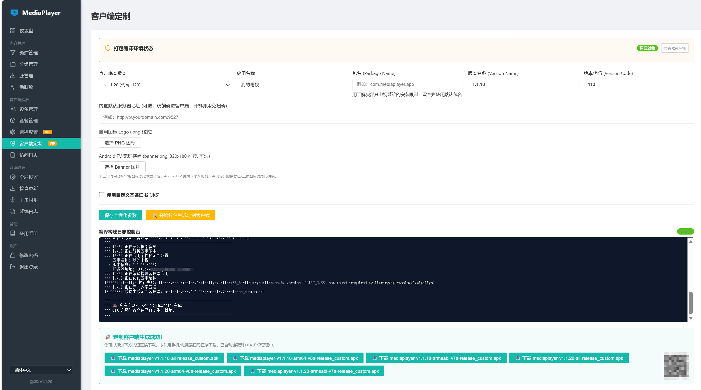

  <h1>MediaPlayer 媒体播放器</h1>
  <p><b>专为 Android TV 与机顶盒打造的本地多媒体播放与列表管理工具 / Local multimedia playback and playlist management tool for Android TV</b></p>
  <p><a href="#中文">中文</a> | <a href="#english">English</a></p>
</div>

---

<a name="中文"></a>
## 🇨🇳 中文说明

> [!IMPORTANT]
> **安全与合规提示：** 本软件是一个纯粹的本地媒体列表管理与播放工具，**不提供、不预装、不托管且不分发任何音视频内容或订阅源（如直播源、M3U列表、EPG等）**。用户须自行寻找并导入播放内容，并对所导入源的合法性与版权合规性负全部责任。请勿利用本软件播放任何侵权或违法的媒体流。

### 🌟 核心理念

MediaPlayer 是一款专为个人和家庭用户设计的**「私有部署播放管理外壳 + 客户端本地播放」**的多媒体工具。

它致力于帮助您管理个人收集的 M3U 播放列表和 EPG 电子节目单，提供简洁、有组织的本地播放体验。本软件为纯粹的技术工具，支持本地局域网设备的安全绑定、配置同步、自定义播放源健康检测及客户端 OTA 本地升级，帮助用户在私有网络环境下安全、便捷地管理与解析个人多媒体内容。

---

### 截图







---

### ✨ 核心产品特色

#### 🛡️ 1. 局域网播放与本地流处理
- **本地连接转发**：支持在用户私有局域网内进行本地流的解析与分发，避免客户端直接暴露外网连接请求，保护个人网络隐私。
- **本地流复用**：当家庭内多台设备播放同一本地媒体流时，支持在私有服务器端进行复用分发，节省家庭宽带资源。
- **组播流与 RTP 优化**：内置高效的组播（UDP/RTP）流接收模块，支持抖动缓冲区（Jitter Buffer）、前向纠错（FEC）与快速换台（FCC），并具备 TS 连续性计数修复（TsCCFixer）功能，有效减少网络抖动引起的马赛克与卡顿。
- **安全验证**：客户端与私有服务端之间采用安全的本地验证机制，防止个人播放列表被局域网内其他未授权设备读取。

#### 👥 2. 个人设备安全管理
- **设备绑定机制**：新客户端设备首次接入时需在私有管理后台进行确认绑定，确保仅限用户本人及家人设备使用。
- **本地连接状态监控**：可在后台面板查看当前绑定的家庭设备连接状态、网速和连接历史。
- **连接断开管理**：可随时手动断开指定家庭设备的本地连接，保障局域网安全。
- **运行日志记录**：记录客户端的运行心跳和基本调试日志，便于用户排查局域网连接故障。

#### 📺 3. 大屏沉浸式体验
- **原生 TV 界面**：专为 Android TV（智能电视、网络机顶盒）大屏设计的原生客户端界面，操作丝滑流畅，支持多格式硬件解码。
- **完全适老化操作**：深度适配电视遥控器和全键盘操作，老人小孩无需学习即可通过方向键 and 确认键完成频道切换、菜单呼出等操作。
- **毫秒级换台**：内置深度优化的底层播放内核（基于 ExoPlayer / VLC），在弱网环境下依然能做到秒开换台。

#### 📂 4. 自动化播放列表维护与管理
- **无缝解析 M3U**：完美兼容各种复杂格式的 M3U/M3U8 列表文件。
- **无感健康检查**：内置频道健康检查机制，支持在后台平滑扫描失效连接，自动剔除或标注不可用频道，完全不影响正在播放的用户。
- **灵活的频道分组**：支持在服务端灵活拖拽排序、批量调整频道分类，让再杂乱无章的播放源都能变得井井有条。
- **EPG 自动同步**：自动同步并缓存 EPG（电子节目单），让观众随时知道“正在播放什么”和“接下来播放什么”。

#### 🔄 5. 无忧的自动版本升级 (OTA)
- **服务端一键拉取**：管理后台深度集成了 GitHub Releases，可自动检测最新版本，并一键下载最新版 APK 到服务端。
- **客户端平滑升级**：电视端每次启动时自动与服务端校验版本。当有新版时，直接从私有服务端高速下载更新并弹出安装提示，从此告别 U盘繁琐拷贝升级。

#### 🎁 6. 捐赠回赠与感谢机制
- **自愿捐赠感谢**：为感谢用户的自愿捐赠支持，系统提供特定回赠功能的解锁，回赠功能按现有状况提供，非商业购买对价。
- **回赠功能绑定**：回赠解锁码与用户的私有服务器进行关联，用于开启进阶的远程配置功能。

#### ⚙️ 7. 远程配置 [捐赠回赠]
- **全局配置同步**：在管理后台统一同步所有已绑定客户端的播放器参数（解码模式、画面比例、缓存策略等）。
- **设备级配置覆盖**：支持对单个家庭设备进行独立播放参数覆盖。
- **界面管理**：支持远程调整客户端界面面板（设置栏、播放列表等）的显示与隐藏，便于家庭统一管理。

#### 🛠️ 8. 客户端定制与自动打包 [捐赠回赠]
- **服务端一键自动打包**：管理后台集成自动打包与签名引擎，支持一键完成定制化客户端构建。
- **个性化应用信息配置**：支持自定义客户端的 应用名称、应用图标、应用包名 及默认服务端连接地址，生成用户专属的安装包。

---

### 🚀 部署与使用

> 本项目分为**服务端（Backend）**和**客户端（Android App）**两部分。服务端提供本地流解析转发、设备绑定管理与后台面板，客户端则安装在电视或机顶盒上提供播放界面。

#### 1. 服务端部署
##### 方法一：Docker
通过公开提供的 Docker 镜像，只需一行命令即可在任何 Linux/NAS 环境中快速拉起服务端：
```bash
docker run -d \
  -p 9527:9527 \
  -v /path/to/your/mediaplayer:/app/data \
  --name mediaplayer-server \
  laoknas/mediaplayer:latest
```
*(部署完成后，即可通过浏览器访问 Web 管理后台，上传您的 M3U 文件并管理设备。)*
*请确保映射的目录`/path/to/your/mediaplayer`有足够的读写权限,否则无法创建文件、修改文件、无法创建客户端安装包*

##### 方法二：[飞牛OS应用](https://github.com/kuai410022283/fnos-mediaplayer)
- 安装时请注意：安装程序目录权限，需要可读写
下载获取mediaplayer.fpk最新服务端，按照说明进行安装

##### 方法三：[群晖套件](https://github.com/kuai410022283/syno-mediaplayer)
- 安装时请注意：安装程序目录权限，需要可读写
下载获取mediaplayer.spk最新服务端，按照说明进行安装

##### 方法四：手动命令安装
```bash
sudo chmod 0755 mediaplayer
./mediaplayer
```

##### 📦 服务端支持架构一览

请根据您的设备架构，从 [Releases 页面](https://github.com/kuai410022283/mediaplayer/releases) 下载对应的二进制包。

**二进制包（tar.gz）**

| 架构 | 文件名 | 适用设备 | 部署方式 |
|------|--------|---------|---------|
| x86-64 | `mediaplayer-linux-amd64.tar.gz` | 软路由（N100/J4125）、NAS、VPS、PVE虚拟机 | 二进制 |
| ARM64 | `mediaplayer-linux-arm64.tar.gz` | 晶晨 S905/S922X、树莓派4+、NAS、瑞芯微 RK3588 | 二进制 |
| ARMv7l | `mediaplayer-linux-arm-armv7l.tar.gz` | 树莓派2/3、晶晨旧款 S805、老款 NAS | 二进制 |
| 龙芯 LoongArch | `mediaplayer-linux-loong64.tar.gz` | 龙芯 3A5000 / 3A6000 及以上 | 二进制 |
| RISC-V 64 | `mediaplayer-linux-riscv64.tar.gz` | VisionFive 2、Milk-V Pioneer 等新兴平台 | 二进制 |
| macOS (Intel) | `mediaplayer-darwin-amd64.tar.gz` | Intel Mac | 二进制 |
| macOS (Apple) | `mediaplayer-darwin-arm64.tar.gz` | Apple Silicon Mac（M1/M2/M3） | 二进制 |
| Windows | `mediaplayer-windows-amd64.zip` | Windows PC | 二进制 |

**Docker 多架构镜像**（同一镜像标签，按宿主机自动匹配）

| 平台 | 适用设备 |
|------|---------|
| `linux/amd64` | 软路由、NAS、VPS |
| `linux/arm64` | 晶晨 S905/S922X、树莓派4+、NAS |
| `linux/arm/v7` | 树莓派2/3、ARMv7 设备 |

> **💡 不确定自己的架构？** 在设备 SSH 终端运行 `uname -m` 查看：
> - `x86_64` → 下载 `amd64`
> - `aarch64` / `arm64` → 下载 `arm64`
> - `armv7l` → 下载 `arm-armv7l`
> - `loongarch64` → 下载 `loong64`
> - `riscv64` → 下载 `riscv64`

#### 2. 客户端安装

请前往本仓库的 **[Releases 页面](https://github.com/kuai410022283/mediaplayer/releases)** 下载最新版本的 `mediaplayer-x.x.x-release.apk`。
- 将 APK 放入 U盘插入电视进行安装，或者通过当贝市场等第三方工具推送到电视端。
- 打开 App 后，系统会自动生成设备唯一识别码，将其提供给服务端管理员进行授权绑定即可开始使用播放器。

---

### 🎮 客户端操作说明

客户端经过深度适老化与全平台兼容设计，同时支持**电视遥控器**按键操作与**手机/平板设备**的触控手势操作。

> **操作速查表**

| 功能区域 | 操作 | 📱 触控/手势 | 📺 遥控操作 |
|---------|------|-------------|-------------|
| **OSD 信息** | 显示信息栏（5 秒自动隐藏） | `单击` (Tap) | `OK 键` |
| **频道列表** | 呼出 | `右滑` (→) | `左键` (←) |
| | 关闭 | `左滑` (←) | `返回键` (BACK) |
| | 浏览频道 | — | `上/下键` |
| | 切换分组 | — | 频道列表中 `左/右键` |
| | 播放选中频道 | — | `OK 键` |
| **EPG 节目单** | 呼出 | `左滑` (←) *无面板时* | 频道列表中焦点 `右键 →` |
| | 关闭 | `右滑` (→) | `返回键` (BACK) |
| **换台** | 上一台 / 下一台 | `上滑` / `下滑` | `上/下键` *无面板时* |
| **设置栏** | 呼出 / 隐藏 | `双击` (Double Tap) | `Menu 键` |
| **线路切换** | 手动选择直播源 | `长按` (Long Press) | `长按 OK 键` |
| **亮度/音量** | 调节亮度与音量 | `屏幕左/右侧上下滑动` | 遥控器 `音量+/-` 键 |
| **音轨/字幕** | 呼出切换面板 | `单击 OSD 上的按钮` | `INFO 键` |
| **点播控制** | 暂停 / 播放 (仅点播模式) | `OSD 显示时单击屏幕` | `OSD 显示时按 OK 键` |

---

### 联系与支持

- QQ Group : [292437580](https://qm.qq.com/q/L2eqy7gkoM)
- Telegram：[@mediaplayer_chat](https://t.me/+3qS4i6yrHsc2MWNl)
- Email：kuai410022283@qq.com
- **捐赠**：如果觉得项目对你有用，可以捐赠任意资金，捐赠的资金会用来维护项目及开发成本。
- 

### LICENSE
请遵守 [LICENSE](LICENSE)，不得用于任何商业用途。

### 免责声明与合规提示 (Disclaimer & Compliance)
1. **中立播放工具**：本软件（包括服务端及客户端）仅为本地化的多媒体播放和流管理外壳工具。开发者**不提供、不集成、不托管、不分发**任何直播源、M3U 订阅、网络链接或音视频内容。
2. **内容合规义务**：用户导入的所有直播源、节目单等内容均由用户手动导入并对其合法性负责。开发者不对用户导入内容的版权合规性、合法性承担任何审查义务，亦不承担任何连带法律责任。
3. **自愿捐赠性质**：本软件核心功能免费。任何形式的捐赠行为均为支持项目发展的无偿自愿赞助，不代表功能或服务的购买对价，捐赠款项一经支付概不退还。
4. **按“现状”提供**：本软件“按原样”提供，开发者不保证其无任何缺陷或兼容性问题，亦不对因使用本软件造成的任何直接或间接损害承担赔偿责任。

更多详细条款，请阅读完整的[《用户使用协议及免责声明》](DISCLAIMER.md)。

---

<a name="english"></a>
## 🇺🇸 English Guide

> [!IMPORTANT]
> **Compliance Notice:** This software is strictly a local playlist manager and playback tool. **It does not provide, pre-configure, host, or distribute any media streams, M3U playlists, or EPG guides.** Users must supply their own media sources and are fully responsible for ensuring the legality and copyright compliance of the imported content. Do not use this tool to stream unauthorized or infringing materials.

### 🌟 Core Concept

MediaPlayer is a **"Private Deployment Backend + Client Playback Shell"** multimedia tool designed for personal and family use.

It helps you manage your self-collected M3U playlists and EPG (Electronic Program Guides) to create a clean, organized local playback experience. As a pure technical tool, MediaPlayer supports secure local device binding, configuration synchronization, stream availability checks, and OTA updates, helping users manage and parse their own media streams safely within a private network environment.

---

### ✨ Core Features

#### 🛡️ 1. LAN Playback & Local Stream Handling
- **Local Stream Forwarding**: Supports stream parsing and forwarding within the user's private local network to protect personal network privacy.
- **Local Stream Multiplexing**: Relay and share a single stream among multiple family devices locally, saving home bandwidth.
- **Multicast & RTP Optimization**: Built-in high-performance multicast (UDP/RTP) stream reader, supporting Jitter Buffer, Forward Error Correction (FEC), Fast Channel Change (FCC), and TS Continuity Counter Fixer (TsCCFixer) to minimize stuttering and pixelation.
- **P2P & RTMP Protocol Forwarding**: Provides streaming translation and forwarding support for protocols like P2P and RTMP to broaden playlist compatibility.
- **Local Verification**: Uses secure verification between the client and the private server to prevent unauthorized local devices from accessing your playlists.

#### 👥 2. Personal Device Management
- **Device Binding**: Newly installed client devices must be confirmed and bound in the private admin backend before use, ensuring access is limited to family members.
- **Connection Status Monitoring**: Check current family device connection status, speed, and history in the admin panel.
- **Manual Disconnection**: Easily disconnect any bound device manually to secure the local network.
- **Basic Run Logs**: Simple logging for client heartbeats and debugging to help troubleshoot LAN connection issues.

#### 📺 3. Immersive TV Experience
- **Native Android TV UI**: Designed specifically for TV screens and set-top boxes, providing smooth navigation and multi-format hardware decoding.
- **Elderly-Friendly Controls**: Fully adapted for remote controls. Users can navigate channels and menus using just the arrow keys and OK buttons.
- **Millisecond Channel Switching**: Optimized playback engines (based on ExoPlayer / VLC) enable instant switching even in unstable networks.

#### 📂 4. Automated Playlist Maintenance & Management
- **Seamless M3U Parsing**: High compatibility with various complex M3U/M3U8 playlist formats.
- **Non-Intrusive Health Check**: Automatically scans and detects invalid stream links in the background without affecting current viewers.
- **Flexible Channel Grouping**: Drag-and-drop to reorder and categorize channels in bulk.
- **EPG Synchronization**: Automatically syncs and caches electronic program guides, displaying what is currently playing and what is next.

#### 🔄 5. OTA Automatic Updates
- **One-Click Server Pull**: The backend integrates GitHub Releases to check for updates and download the latest client APK with one click.
- **Seamless Client Updates**: The TV client checks version state on boot, downloading updates directly from the private server.

#### 🎁 6. Donation Rewards
- **Voluntary Support**: Donation is completely voluntary to support development and maintenance. Selected thank-you features are offered as single-sided rewards.
- **Reward Binding**: Unlock codes are linked to the private server instances to enable advanced configuration sharing.

#### ⚙️ 7. Remote Configuration [Donation Reward]
- **Global Config Sync**: Synchronize playback parameters (decoder mode, scale, cache) across all bound clients easily.
- **Device-Level Override**: Adjust and override configs for individual family devices.
- **UI Control**: Show/hide client panels or menu items for clean, simplified family TV navigation.

#### 🛠️ 8. Client Customization & Auto Packaging [Donation Reward]
- **One-Click Server Packaging**: Built-in automatic packaging and signing engine in the admin backend, supporting one-click customized client builds.
- **Personalized App Information**: Customize the client's App Name, App Icon, Package Name, and default server connection address to generate your own exclusive installation package.

---

### 🚀 Deployment & Usage

> The project consists of two parts: the **Server (Backend)** and the **Client (Android App)**. The server handles local stream forwarding and device management, while the client provides the playback interface.

#### 1. Server Deployment
##### Method 1: Docker
Deploy in seconds on any Linux or NAS environment with a single command:
```bash
docker run -d \
  -p 9527:9527 \
  -v /path/to/your/mediaplayer:/app/data \
  --name mediaplayer-server \
  laoknas/mediaplayer:latest
```
*(After deployment, visit `http://<NAS_IP>:9527` in your browser to access the web panel and upload your M3U files.)*
*Please ensure the mapped directory `/path/to/your/mediaplayer` has sufficient read/write permissions, otherwise, files cannot be created, modified, or the client installation package cannot be generated.*

##### Method 2: [fnOS App](https://github.com/Brian099/fn_fpk_packages/blob/main/README.md)
Download the latest `mediaplayer.fpk` file and follow instructions.

##### Method 3: [Synology SPK](https://github.com/kuai410022283/syno-mediaplayer)
Download the latest `mediaplayer.spk` file and install via Package Center.

##### Method 4: Manual Command
```bash
sudo chmod 0755 mediaplayer
./mediaplayer
```

##### 📦 Supported Server Architectures

Download binaries from the [Releases Page](https://github.com/kuai410022283/mediaplayer/releases).

**Binaries (tar.gz)**

| Architecture | Filename | Compatible Devices | Deployment |
|------|--------|---------|---------|
| x86-64 | `mediaplayer-linux-amd64.tar.gz` | NAS, VPS, VM, J4125/N100 Routers | Binary |
| ARM64 | `mediaplayer-linux-arm64.tar.gz` | Raspberry Pi 4+, TV Boxes (S905/S922X), RK3588 | Binary |
| ARMv7l | `mediaplayer-linux-arm-armv7l.tar.gz` | Raspberry Pi 2/3, Older NAS/TV Boxes | Binary |
| LoongArch64 | `mediaplayer-linux-loong64.tar.gz` | Loongson 3A5000 / 3A6000 | Binary |
| RISC-V 64 | `mediaplayer-linux-riscv64.tar.gz` | VisionFive 2, Milk-V Pioneer | Binary |
| macOS (Intel) | `mediaplayer-darwin-amd64.tar.gz` | Intel Macs | Binary |
| macOS (Apple) | `mediaplayer-darwin-arm64.tar.gz` | Apple Silicon Macs (M1/M2/M3) | Binary |
| Windows | `mediaplayer-windows-amd64.zip` | Windows PC | Binary |

**Docker Multi-Arch Images** (Pulls correct architecture automatically)

| Platform | Devices |
|------|---------|
| `linux/amd64` | Intel/AMD NAS, VPS |
| `linux/arm64` | Raspberry Pi 4+, ARM64 NAS |
| `linux/arm/v7` | Raspberry Pi 2/3, ARMv7 |

> **💡 Not sure about your architecture?** Run `uname -m` in your terminal:
> - `x86_64` ➔ Download `amd64`
> - `aarch64` / `arm64` ➔ Download `arm64`
> - `armv7l` ➔ Download `arm-armv7l`

#### 2. Client Installation

Go to the **[Releases Page](https://github.com/kuai410022283/mediaplayer/releases)** and download `mediaplayer-x.x.x-release.apk`.
- Copy it to a USB drive and plug it into your TV, or push it via third-party TV market tools.
- Once opened, the client will display a unique Device ID. Give this ID to the administrator for approval to start using the player.

---

### 🎮 Client Operation & Guide

The client is fully compatible with both **TV remote controls** (key navigation) and **mobile/tablet touch gestures**.

> **Control Quick Reference**

| Area / Action | Purpose | 📱 Touch / Gesture | 📺 TV Remote |
|---------|------|-------------|-------------|
| **OSD Information** | Show Info Panel (auto-hides in 5s) | `Tap` | `OK Button` |
| **Channel List** | Open | `Swipe Right` (→) | `Left Button` (←) |
| | Close | `Swipe Left` (←) | `Back Button` (BACK) |
| | Navigate Channels | — | `Up / Down Buttons` |
| | Switch Groups | — | `Left / Right` inside list |
| | Play Selected | — | `OK Button` |
| **EPG Guide** | Open | `Swipe Left` (←) *when list is closed* | `Right Button` from list |
| | Close | `Swipe Right` (→) | `Back Button` (BACK) |
| **Switch Channels** | Previous / Next Channel | `Swipe Up` / `Swipe Down` | `Up/Down` *when list is closed* |
| **Settings Panel** | Toggle Settings Overlay | `Double Tap` | `Menu Button` |
| **Source Line Switch** | Select fallback live source | `Long Press` | `Long Press OK` |
| **Brightness / Vol** | Adjust screen values | `Swipe Up/Down on Left/Right side` | Remote `Volume +/-` |
| **Audio / Subtitle** | Show track selectors | `Tap button on OSD` | `INFO Button` |
| **VOD Control** | Play / Pause (VOD mode only) | `Tap screen when OSD is visible` | `OK when OSD is visible` |

---

### Contact & Support

- QQ Group : [292437580](https://qm.qq.com/q/L2eqy7gkoM)
- Telegram: [@mediaplayer_chat](https://t.me/+3qS4i6yrHsc2MWNl)
- Email: kuai410022283@qq.com
- **Donation**: If this project is helpful to you, donations to cover maintenance and server costs are highly appreciated.
- 

### LICENSE
Please comply with the [LICENSE](LICENSE). Commercial use is strictly prohibited.

### Disclaimer & Legal Compliance
1. **Neutral Media Tool**: This Software (including server and client) is strictly a media playback shell and streaming management tool. The developer **does not provide, pre-configure, host, or distribute** any live stream URLs, M3U playlists, or media content.
2. **Content Legality**: Users are solely responsible for obtaining and verifying the legality and copyright compliance of any media sources they import. The developer assumes no liability for any copyright infringement or legal issues arising from user-imported content.
3. **Voluntary Donations**: The core features of this Software are free. Donations are purely voluntary contributions to support the project's development and do not constitute a purchase of features or services. Donations are non-refundable.
4. **Provided "AS-IS"**: The Software is provided "AS-IS" without warranties of any kind. The developer shall not be liable for any direct or indirect damages resulting from the use or inability to use the Software.

For more details, please read the complete [User Agreement & Disclaimer](DISCLAIMER_EN.md).
